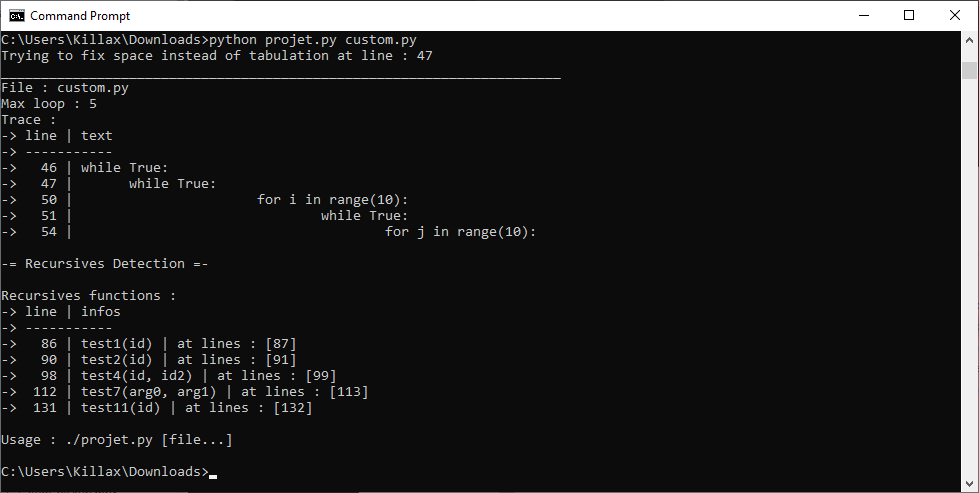

# Python code analyzer

Python analyzer est un petit programme réaliser pendant mes études Universitaire afin d'évaluer la compléxiter de mes programmes, réalisé en Python, il permet d'analyser des scripts de ce même langage est de retourné la boucle imbriqué la plus importante du programme ainsi que toutes les fonctions récursives avec leurs appels.

<p align="center"></p>

## Requis :

Le programme requiert une version de Python >= 3.6.0
Un fichier de test est fournis avec le code afin de montrer les capacités du programmes ainsi que ces limitations

## Utilisations :

```bash
# Linux :
./analyzer.py test.py [file...]

# Windows :
python analyzer.py test.py [file...]
```

## Version :

Dernière version stable : [V-2.0.9](changelogs/v2.0.9.md)